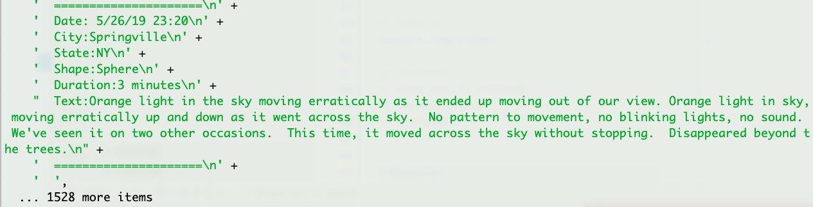
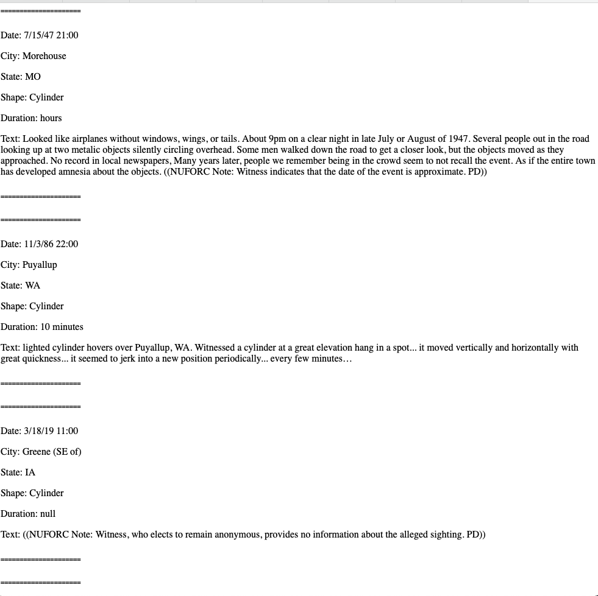
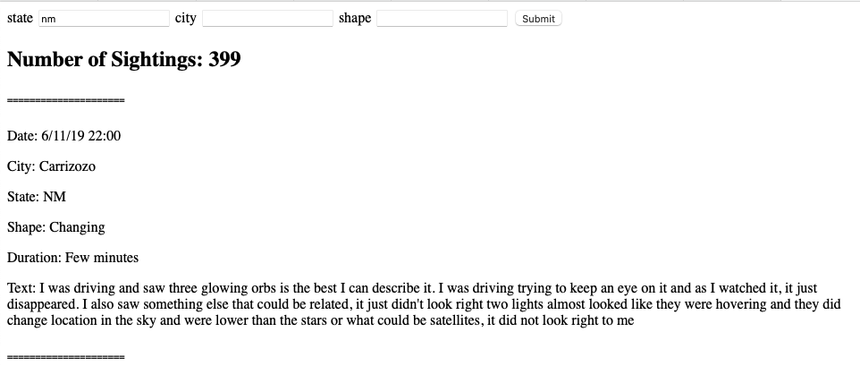
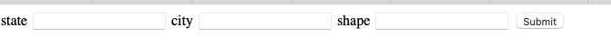
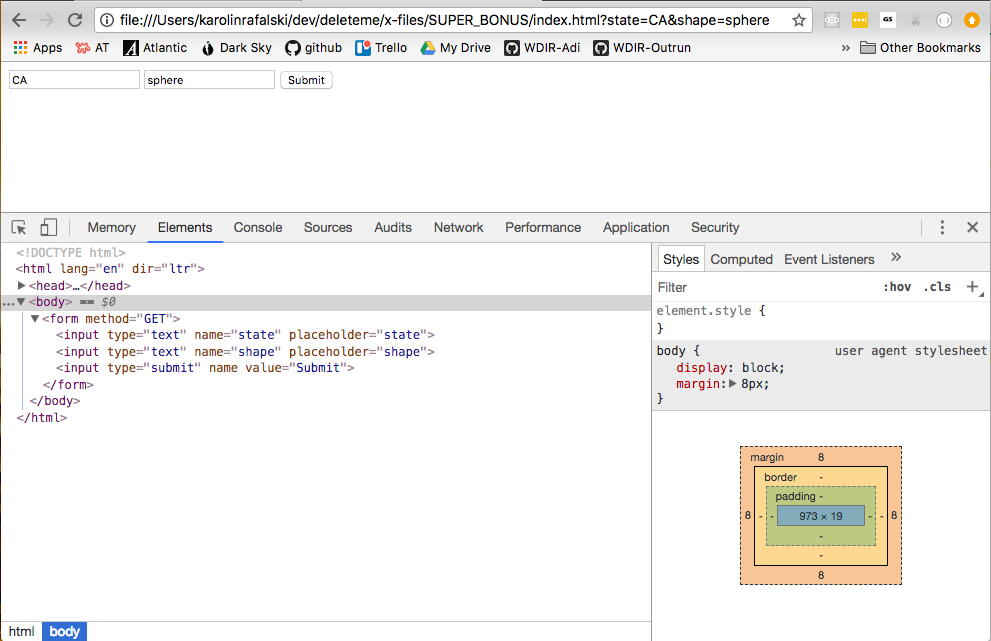

# Express-UFO

You just wrapped up some very long sessions perfecting your LinkedIn profile. You wonder, will anyone notice?

Then you get a message from Erin Rust, a recent celebrity who just made a mind-boggling fortune in crypto-currency.

Erin has a big business idea. While other companies are out building rockets into space, Erin wants to form a partnership with aliens to secure journeys for humans on their U.F.O.s.

She has already hired an Intergalactic Strategic Partnership team, these people are ready to put themselves in whatever situation it takes to make contact and strike business deals with aliens.

The problem is that the ISP team doesn't know where to go. Thanks to the excellent work of [Keith Turner](https://data.world/khturner), the company has been able to download a few MB of UFO sightings data as JSON. From [data.world](https://data.world/khturner/national-ufo-reporting-center-reports).

The ISP team doesn't know how to search through the data, so it will be up to you to build a simple express backend that will let them see the information they need in a a user-friendly way.

## Getting Started

The team is thrilled to have you here and want to be able to access the data ASAP.

Let's build them a simple terminal app, where they can type
`node app.js state=NY` in order to see all the sightings in NY.

<details><summary>Hint Getting Started</summary>

1. `touch app.js`
1. require the `nuforc_reports.json` file

```js
// access the data in this file
const sightingsData = require("./sightings.json");

// test it
console.log(sightingsData[0]);

// expected output
// { date: '1/31/15 22:00',
//  city: 'Lancaster',
//  state: 'CA',
//  shape: 'Sphere',
//  duration: 'several minutes',
// description: 'Orange lights.' }
```

</details>

<details><summary>Hint: Using terminal to get data by state</summary>

1. `touch app.js`
1. require the `nuforc_reports.json` file

```js
// access the argument
const state = process.argv[2];

// test it
console.log(state);

// Terminal
// node app.js state=NY
// expected output
// state=NY
```

</details>

<br />
<br />

**SUCCESS**



## Make an Express App

**Note:** The example URLs have a PORT of `3333`

The Team doesn't like using Terminal! It's scary! They would all feel much more at ease using a browser.

The team should be able to go to `localhost:3333/sightings[query]`

And be able to see their requests as html (use `res.send()` to send long strings of HTML with the data embedded:

- by state
- by city
- by shape

http://localhost:3333/sightings?state=&city=&shape=Cylinder

Should show all the reports of cylinder shaped sightings.



Or this query:

http://localhost:3333/sightings?state=VA&city=Roanoke&shape=sphere

Should show all the sphere shaped encounters in Roanoke, VA

## Add the total number of sightings



## Create a form that makes the queries



<details><summary>Hint: Use Chrome Dev Tools to look at a sample form</summary>



</details>

## Bonus

- Figure out a way to sort the results by city, time, or state
